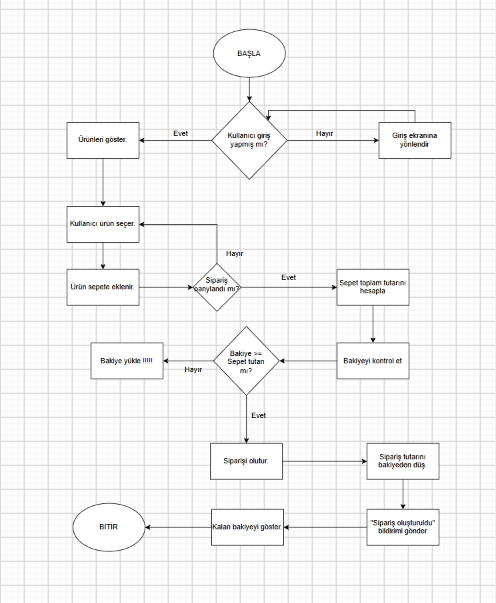

# Kahve Sipariş Uygulaması Ödevi

## GÖREV 1: Mobil Akış Şeması (Flowchart) veya Sözde Kod

    

### Seçenek B: Sözde Kod / Pseudocode

```text
BAŞLA

EĞER kullanıcı giriş yapmamış ise
    Giriş ekranına gönder
DEĞİLSE
    Ürünleri göster

    DÖNGÜ
        Kullanıcı bir ürün seçer
        Seçilen ürünü sepete ekler
    Kullanıcı siparişi onaylayana kadar devam et

    Sepet toplam tutarını hesapla
    Bakiyeyi kontrol et

    EĞER bakiye yeterliyse (bakiye >= sepet tutarı)
        Siparişi oluştur
        Bakiyeden sepet tutarını düş
        "Sipariş oluşturuldu" bildirimi gönder
    DEĞİLSE
        "Bakiye Yükle" uyarısı ver
    BİTİR
BİTİR

BİTİR
```

---

## GÖREV 2: REST API Uç Noktası (Endpoint) & JSON Tasarımı

### 1. Sipariş Oluşturma Endpoint'i

* **HTTP Metodu:** `POST`
* **URL / Endpoint:** `/api/v1/siparisler`
* **Header:**

  * `Authorization: Bearer <token>`
  * `Content-Type: application/json`

### Örnek Request Body

```json
{
  "kahve_adi": "Filtre",
  "boyut": "Orta",
  "adet": 2,
  "urun_tutari": 90.00,
  "toplam_tutar": 180.00
}
```

* **Başarılı Sonuç HTTP Durum Kodu:** `201 Created`
* **Kullanıcı Giriş Yapmamışsa Dönecek HTTP Durum Kodu:** `401 Unauthorized`

---

### 2. Cüzdan Bakiye Sorgulama Endpoint'i

* **HTTP Metodu:** `GET`
* **URL / Endpoint:** `/api/v1/kullanici/bakiye`

### Örnek Response

```json
{
  "bakiye": 185.50,
  "para_birimi": "TRY"
}
```

* **Sunucuda Beklenmeyen Hata Çıkarsa Dönecek Durum Kodu:** `500 Internal Server Error`

### Mini Mülakat Sorusu

**Yukarıdaki GET ve POST isteklerinden hangisi Idempotent (Eşgüçlü) bir istektir, hangisi değildir? Neden?**

GET idempotenttir, çünkü sadece veri okur ve tekrar edilmesi sonucu değiştirmez. POST idempotent değildir, çünkü tekrar gönderildiğinde yeni siparişler oluşturabilir.

---

## GÖREV 3: Clean Code & SOLID Prensip Teşhisi

Aşağıda junior bir geliştirici tarafından yazılmış temsili bir sipariş sınıfı yer almaktadır:

```java
class KahveSiparisYoneticisi {

    void sepetHesaplaVeIndirimUygula() { ... }

    void krediKartindanTahsilatYap() { ... }

    void siparisiVeritabaninaKaydet() { ... }

    void musteriyiSmsIleBilgilendir() { ... }

    double indirimHesapla(String musteriTipi, double tutar) {

        if (musteriTipi == "OGRENCI")
            return tutar * 0.80;

        else if (musteriTipi == "OGRETMEN")
            return tutar * 0.85;

        else
            return tutar;
    }
}
```

### Soru 1

**Bu sınıfta Single Responsibility Principle (SRP - Tek Sorumluluk) nasıl ihlal edilmiştir? Sınıfı hangi küçük parçalara bölmeliyiz?**

Tek bir sınıfın birden fazla görevi vardır. Sepet ve indirim hesaplama, kredi kartı ödemesi, veritabanına kayıt ve SMS bilgilendirme işlemleri için ayrı sınıflar oluşturularak her sınıfın sorumluluğu tek bir göreve düşürülmelidir.

---

### Soru 2

**`indirimHesapla` fonksiyonunda yarın yeni bir müşteri tipi (örneğin `"DOKTOR"`) geldiğinde `if-else` kodunu değiştirmek zorunda kalmak hangi SOLID prensibine aykırıdır?**

Bu durum **Open/Closed Principle (OCP)** ihlalidir. Bir kod genişletmeye açık, değişikliğe kapalı olmalıdır; fakat DOKTOR geldiğinde `indirimHesapla` metodundaki `if-else` bloğunu değiştirmek zorunda kalıyoruz.
